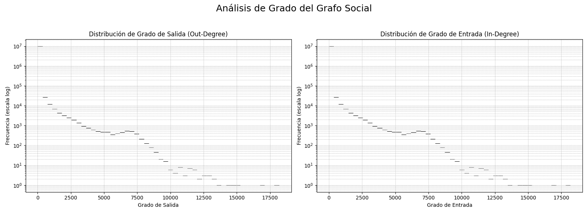

# ADA
Repositorio para el curso de análisis y diseño de algoritmos.

## Integrantes

- Jhordan Steven Octavio Huamani Huamani
- Jorge Luis Ortiz Castañeda

# Procesador de Redes Sociales a Gran Escala

Este proyecto implementa un sistema optimizado para cargar, procesar y analizar datos de redes sociales a gran escala (hasta 10 millones de usuarios). Utiliza técnicas eficientes de manejo de memoria y procesamiento por lotes para construir un grafo dirigido que representa la red social, junto con datos de geolocalización de los usuarios.

## 🚀 Características Principales

- **Procesamiento Eficiente:** Carga y procesa 10 millones de registros de usuarios y ubicaciones geográficas con optimización de memoria.
- **Construcción de Grafo:** Utiliza [igraph](https://igraph.org/python/) para generar un grafo dirigido de la red social optimizado para análisis.
- **Análisis Exploratorio:** Incluye análisis básico del grafo con métricas como grados de entrada/salida, componentes conectados y densidad.
- **Gestión Robusta de Errores:** Sistema exhaustivo de manejo de excepciones y validación de datos.
- **Logging Detallado:** Registro completo de todas las operaciones y errores para facilitar depuración.

## 📋 Requisitos

- Python 3.6+
- NumPy
- python-igraph
- Espacio en disco suficiente para archivos de datos (estimado ~5GB)
- Memoria RAM recomendada: 16GB+ (optimizado para usar menos memoria que soluciones naive)

## 🗂️ Estructura de Datos

El programa trabaja con dos archivos de entrada principales:

1. **Archivo de Ubicaciones (`10_million_location.txt`)**:
   - Cada línea contiene coordenadas geográficas (latitud,longitud)
   - El número de línea corresponde al ID de usuario
   - Formato: `lat,lon` (ej: `40.7128,-74.0060`)

2. **Archivo de Usuarios (`10_million_user.txt`)**:
   - Cada línea contiene relaciones de seguimiento
   - Formato: `user_id,follower1_id,follower2_id,...`
   - El primer número es el ID del usuario, seguido por los IDs de los usuarios que sigue

## 🛠️ Instalación

```bash
# Clonar el repositorio
git clone https://github.com/usuario/procesador-redes-sociales.git
cd procesador-redes-sociales

# Instalar dependencias
pip install numpy igraph networkx matplotlib plotly pandas tqdm python-louvain leidenalg

# Crear directorio para datos procesados
mkdir -p ./processed_data
```

## 🔧 Configuración

Ajusta las variables en la sección de configuración del script:

```python
# --- Configuration ---
NUM_USERS = 10_000_000
LOCATION_TXT_FILE = './dataset/10_million_location.txt'
USER_TXT_FILE = './dataset/10_million_user.txt'
OUTPUT_DIR = './processed_data'
```

## 🚀 Uso

Ejecuta el script principal:

```bash
python graph_builder.py
```

El proceso completo incluye:
1. Carga de datos de geolocalización
2. Construcción del grafo social optimizada para memoria
3. Análisis exploratorio básico
4. Guardado de datos procesados para uso futuro

## 📊 Salidas

El programa genera los siguientes archivos:

1. **`social_network_graph_10M.igraph.pkl`**: Grafo completo serializado
2. **`social_network_locations_10M.pkl`**: Diccionario de ubicaciones por ID
3. **`social_network_idx2id_10M.pkl`**: Mapeo de índices internos a IDs originales
4. **`social_network_id2idx_10M.pkl`**: Mapeo de IDs originales a índices internos
5. **`graph_builder.log`**: Archivo de registro detallado

## 📝 Detalles Técnicos

### Optimizaciones de Memoria
- **Procesamiento en dos pasadas**: Primero recolecta IDs únicos, luego genera aristas
- **Uso de generadores**: Evita listas de aristas en memoria durante la construcción
- **Mapeo de IDs**: Convierte IDs originales (potencialmente grandes) a índices compactos
- **NumPy para ubicaciones**: Utiliza arrays tipados para eficiencia

### Análisis Exploratorio de Datos
El script realiza automáticamente un análisis básico que incluye:
- Densidad del grafo
- Distribución de grados de entrada/salida
- Usuarios con más seguidores y seguidos
- Usuarios aislados (sin seguidores o seguidos)
- Componentes conectados
- Estadísticas de la red social

## 🔍 Manejo de Errores y Validación
- Validación de coordenadas geográficas
- Manejo de datos malformados o faltantes
- Tratamiento de IDs inválidos o inconsistentes
- Control de memoria para evitar desbordamientos
- Logging detallado para diagnóstico y monitoreo

## 📖 Ejemplo de Análisis

El análisis básico produce información como:

```
2025-06-25 07:18:18,451 - INFO - [Analyzer] --- INICIANDO SCRIPT DE ANÁLISIS DE GRAFO ---
2025-06-25 07:18:18,452 - INFO - [Analyzer] Iniciando la carga de datos pre-procesados...
2025-06-25 07:23:07,659 - INFO - [Analyzer] Datos de grafo y mapeos cargados.
2025-06-25 07:23:07,671 - INFO - [Analyzer] --- 1. Análisis de Métricas Básicas ---
2025-06-25 07:23:07,674 - INFO - [Analyzer] Nodos: 10,000,000, Aristas: 169,488,182, Densidad: 1.6949e-06
2025-06-25 07:23:07,675 - INFO - [Analyzer] --- 2. Análisis de Centralidad de Grado (Top 10) ---
2025-06-25 07:23:08,568 - INFO - [Analyzer] Top Usuarios con más seguidores (Más Populares):
2025-06-25 07:23:08,570 - INFO - [Analyzer]   - ID 10939: 18,187 seguidores
2025-06-25 07:23:08,570 - INFO - [Analyzer]   - ID 6672: 16,795 seguidores
2025-06-25 07:23:08,570 - INFO - [Analyzer]   - ID 17771: 15,021 seguidores
2025-06-25 07:23:08,571 - INFO - [Analyzer]   - ID 12410: 14,740 seguidores
2025-06-25 07:23:08,571 - INFO - [Analyzer]   - ID 17654: 14,393 seguidores
2025-06-25 07:23:08,571 - INFO - [Analyzer]   - ID 10642: 13,800 seguidores
2025-06-25 07:23:08,571 - INFO - [Analyzer]   - ID 12798: 13,420 seguidores
2025-06-25 07:23:08,571 - INFO - [Analyzer]   - ID 15874: 13,267 seguidores
2025-06-25 07:23:08,571 - INFO - [Analyzer]   - ID 99392: 12,865 seguidores
2025-06-25 07:23:08,571 - INFO - [Analyzer]   - ID 15105: 12,858 seguidores
2025-06-25 07:23:09,418 - INFO - [Analyzer] Top Usuarios que siguen a más personas (Más Activos):
2025-06-25 07:23:09,419 - INFO - [Analyzer]   - ID 10939: sigue a 18,187 usuarios
2025-06-25 07:23:09,419 - INFO - [Analyzer]   - ID 6672: sigue a 16,795 usuarios
2025-06-25 07:23:09,419 - INFO - [Analyzer]   - ID 17771: sigue a 15,021 usuarios
2025-06-25 07:23:09,420 - INFO - [Analyzer]   - ID 12410: sigue a 14,740 usuarios
2025-06-25 07:23:09,420 - INFO - [Analyzer]   - ID 17654: sigue a 14,393 usuarios
2025-06-25 07:23:09,420 - INFO - [Analyzer]   - ID 10642: sigue a 13,800 usuarios
2025-06-25 07:23:09,421 - INFO - [Analyzer]   - ID 12798: sigue a 13,420 usuarios
2025-06-25 07:23:09,421 - INFO - [Analyzer]   - ID 15874: sigue a 13,267 usuarios
2025-06-25 07:23:09,421 - INFO - [Analyzer]   - ID 99392: sigue a 12,865 usuarios
2025-06-25 07:23:09,421 - INFO - [Analyzer]   - ID 15105: sigue a 12,858 usuarios
2025-06-25 07:23:09,467 - INFO - [Analyzer] --- 3. Análisis de Conectividad (WCC y SCC) ---
2025-06-25 07:26:17,965 - INFO - [Analyzer] Componentes Débilmente Conectados (WCC):
2025-06-25 07:26:17,972 - INFO - [Analyzer]   - Número total de componentes: 623
2025-06-25 07:26:56,907 - INFO - [Analyzer]   - Tamaño del componente gigante: 9,998,486 nodos (99.98%)
2025-06-25 07:27:29,945 - INFO - [Analyzer] Componentes Fuertemente Conectados (SCC):
2025-06-25 07:27:29,945 - INFO - [Analyzer]   - Número total de componentes: 623
2025-06-25 07:29:38,754 - INFO - [Analyzer]   - Tamaño del componente gigante: 9,998,486 nodos (99.98%)
2025-06-25 07:29:38,761 - INFO - [Analyzer] Análisis de conectividad completado en 9.29s.
2025-06-25 07:29:45,927 - INFO - [Analyzer] --- 4. Camino Más Corto Promedio Ponderado (Muestra de 10000) ---
2025-06-25 07:29:51,516 - INFO - [Analyzer] Ejecutando Dijkstra ponderado desde 10000 nodos...
2025-06-25 07:34:01,123 - INFO - [Analyzer] Camino más corto promedio (estimado): 4,458.00 km
2025-06-25 07:34:02,385 - INFO - [Analyzer] --- 5. Detección de Comunidades (Algoritmo de Louvain) ---
2025-06-25 07:34:04,378 - INFO - [Analyzer] Conversión numpy completada en 2.99s
2025-06-25 07:38:28,930 - INFO - [Analyzer] Detección de comunidades completada en 266.54s.
2025-06-25 07:38:32,495 - INFO - [Analyzer] Número de comunidades detectadas: 2,398,181
2025-06-25 07:38:37,734 - INFO - [Analyzer] Modularidad del grafo: 0.3468
2025-06-25 07:38:37,816 - INFO - [Analyzer] Tamaño de las 5 comunidades más grandes:
2025-06-25 07:38:37,816 - INFO - [Analyzer]   - Comunidad 1: 2,623 nodos
2025-06-25 07:38:37,817 - INFO - [Analyzer]   - Comunidad 2: 2,406 nodos
2025-06-25 07:38:37,817 - INFO - [Analyzer]   - Comunidad 3: 1,955 nodos
2025-06-25 07:38:37,817 - INFO - [Analyzer]   - Comunidad 4: 1,817 nodos
2025-06-25 07:38:37,817 - INFO - [Analyzer]   - Comunidad 5: 861 nodos
2025-06-25 07:38:37,900 - INFO - [Analyzer] ---6. Kruskal MST ---
2025-06-25 07:38:38,718 - INFO - [Analyzer] MST Kruskal contiene 9,998 aristas.
2025-06-25 07:38:38,719 - INFO - [Analyzer] Coste total del Kruskal (distancia total): 4,319.94 km
2025-06-25 07:38:38,719 - INFO - [Analyzer] Tiempo de ejecución Kruskal: 0.82 segundos
2025-06-25 07:38:38,783 - INFO - [Analyzer] ---7. Prim MST ---
2025-06-25 07:38:39,924 - INFO - [Analyzer] MST Prim contiene 9,572,872 aristas.
2025-06-25 07:38:39,924 - INFO - [Analyzer] Coste total del Prim (distancia total): 4,299.62 km
2025-06-25 07:38:39,925 - INFO - [Analyzer] Tiempo de ejecución Prim: 1.14 segundos
2025-06-25 07:38:39,932 - INFO - [Analyzer] --- 8. Consultando a quién sigue el usuario ID 223 ---
2025-06-25 07:38:39,933 - INFO - [Analyzer] El usuario con ID 223 sigue a 2,857 usuarios.
2025-06-25 07:38:39,933 - INFO - [Analyzer]   - Lista de seguidos (primeros 20): [1, 12, 14, 24, 31, 60, 60, 88, 117, 117, 172, 179, 201, 201, 221, 221, 234, 241, 247, 250]
2025-06-25 07:38:40,353 - INFO - [Analyzer] Archivo de estadísticas exportado a ./visualizations/stats.json
2025-06-25 07:38:40,353 - INFO - [Analyzer] --- SCRIPT DE ANÁLISIS DE GRAFO FINALIZADO ---
```
## Imágenes

### Distribución de Grados


Esta visualización muestra dos gráficas en escala logarítmica (Log-Log):
- **Gráfica Izquierda (Grado de Entrada)**: Muestra la distribución de seguidores, donde se observa que pocos usuarios tienen muchos seguidores (influencers) y la mayoría tiene pocos seguidores.
- **Gráfica Derecha (Grado de Salida)**: Representa cuántos usuarios siguen a otros, mostrando que la mayoría sigue a un número moderado de personas.

## 🚧 Limitaciones

- **Compatibilidad de librerías GPU:** No fue posible utilizar librerías como `cugraph` o `cupy` para acelerar el procesamiento en GPU debido a restricciones del sistema operativo Windows y la incompatibilidad con Python 3.11 en adelante. Esto limitó la posibilidad de aprovechar aceleración por hardware para grafos de gran escala.
- **Tiempos de cómputo:** El análisis de caminos más cortos y detección de comunidades en grafos tan grandes puede tomar varios minutos u horas dependiendo del hardware.

## 🚀 Implementaciones Futuras

- **Soporte para GPU y librerías avanzadas:** Migrar a un entorno Linux y Python 3.10 o inferior para habilitar el uso de `cugraph`, `cupy` y otras librerías de aceleración por GPU.
- **Paralelización y procesamiento distribuido:** Implementar procesamiento paralelo (multiproceso/multihilo) y/o integración con frameworks como Dask o Spark para reducir tiempos de cómputo.
- **Visualizaciones interactivas:** Integrar al dashboards nuevas vistas.

## 🧠 Decisiones Algorítmicas y Comparativas

### Camino Más Corto Promedio: ¿Por qué Dijkstra?
- **Dijkstra** es el algoritmo estándar para encontrar caminos más cortos en grafos ponderados con pesos positivos. Es eficiente (O((V+E)logV) usando heap) y no requiere heurísticas.
- **A\*** requiere una heurística admisible y eficiente, lo cual no es trivial en grafos sociales de gran escala y sin una métrica espacial clara entre todos los nodos.
- **Floyd-Warshall** tiene complejidad O(V³), inviable para millones de nodos.
- **BFS** solo sirve para grafos no ponderados.
- **Comparativa:** Dijkstra es el mejor compromiso entre exactitud y eficiencia para nuestro caso.

### Árbol de Expansión Mínima: Kruskal vs. Prim
- **Kruskal** (O(E log E)) es ideal para grafos dispersos y permite construir el MST ordenando aristas por peso.
- **Prim** (O(E + V log V) con heap) es eficiente para grafos densos y cuando se requiere construir el MST a partir de un nodo.
- **Comparativa:** Ambos algoritmos fueron implementados para comparar resultados y tiempos. En la práctica, Kruskal suele ser más rápido en grafos grandes y dispersos como los de redes sociales.

### Detección de Comunidades: Louvain
- **Louvain** es un algoritmo heurístico eficiente para detección de comunidades en grafos grandes (O(n log n)), maximizando la modularidad.
- **Alternativas:** Algoritmos como Girvan-Newman (O(E²V)), Label Propagation (O(V+E)), o Leiden (mejora de Louvain) existen, pero Louvain ofrece un excelente balance entre calidad y velocidad para grafos de millones de nodos.

### Resumen de Complejidades Algorítmicas

| Algoritmo         | Complejidad Temporal | Comentario |
|-------------------|---------------------|------------|
| Dijkstra          | O((V+E) log V)      | Camino más corto ponderado |
| Kruskal           | O(E log E)          | MST, ideal para grafos dispersos |
| Prim              | O(E + V log V)      | MST, eficiente en grafos densos |
| Louvain           | ~O(n log n)         | Comunidades, heurístico |
| Girvan-Newman     | O(E²V)              | Comunidades, inviable para grafos grandes |
| Floyd-Warshall    | O(V³)               | Todos los pares, inviable |

> **Nota:** V = número de nodos, E = número de aristas, n = número de nodos.

---
## 🚧 Limitaciones

- **Compatibilidad de librerías GPU:** No fue posible utilizar librerías como `cugraph` o `cupy` para acelerar el procesamiento en GPU debido a restricciones del sistema operativo Windows y la incompatibilidad con Python 3.11 en adelante. Esto limitó la posibilidad de aprovechar aceleración por hardware para grafos de gran escala.
- **Consumo de memoria:** Aunque se optimizó el uso de memoria, el procesamiento de 10 millones de usuarios sigue siendo intensivo y puede requerir más de 16GB de RAM en etapas de análisis complejos.
- **Tiempos de cómputo:** El análisis de caminos más cortos y detección de comunidades en grafos tan grandes puede tomar varios minutos u horas dependiendo del hardware.
- **No se implementó paralelización avanzada:** El procesamiento es principalmente secuencial y no aprovecha multiprocesamiento o computación distribuida.
- **Dependencia de archivos bien formateados:** El sistema asume que los archivos de entrada siguen el formato especificado; errores graves en el formato pueden detener el procesamiento.

## 🚀 Implementaciones Futuras

- **Soporte para GPU y librerías avanzadas:** Migrar a un entorno Linux y Python 3.10 o inferior para habilitar el uso de `cugraph`, `cupy` y otras librerías de aceleración por GPU.
- **Paralelización y procesamiento distribuido:** Implementar procesamiento paralelo (multiproceso/multihilo) y/o integración con frameworks como Dask o Spark para reducir tiempos de cómputo.
- **Visualizaciones interactivas:** Integrar dashboards interactivas para explorar comunidades, rutas y métricas en tiempo real.
- **Soporte para streaming de datos:** Adaptar el sistema para procesar datos en tiempo real o por lotes incrementales.
- **Algoritmos alternativos:** Explorar variantes de algoritmos para caminos más cortos, MST y detección de comunidades según el tipo de red y recursos disponibles.

## 🧠 Decisiones Algorítmicas y Comparativas

### Camino Más Corto Promedio: ¿Por qué Dijkstra?
- **Dijkstra** es el algoritmo estándar para encontrar caminos más cortos en grafos ponderados con pesos positivos. Es eficiente (O((V+E)logV) usando heap) y no requiere heurísticas.
- **A\*** requiere una heurística admisible y eficiente, lo cual no es trivial en grafos sociales de gran escala y sin una métrica espacial clara entre todos los nodos.
- **Floyd-Warshall** tiene complejidad O(V³), inviable para millones de nodos.
- **BFS** solo sirve para grafos no ponderados.
- **Comparativa:** Dijkstra es el mejor compromiso entre exactitud y eficiencia para nuestro caso.

### Árbol de Expansión Mínima: Kruskal vs. Prim
- **Kruskal** (O(E log E)) es ideal para grafos dispersos y permite construir el MST ordenando aristas por peso.
- **Prim** (O(E + V log V) con heap) es eficiente para grafos densos y cuando se requiere construir el MST a partir de un nodo.
- **Comparativa:** Ambos algoritmos fueron implementados para comparar resultados y tiempos. En la práctica, Kruskal suele ser más rápido en grafos grandes y dispersos como los de redes sociales.

### Detección de Comunidades: Louvain
- **Louvain** es un algoritmo heurístico eficiente para detección de comunidades en grafos grandes (O(n log n)), maximizando la modularidad.
- **Alternativas:** Algoritmos como Girvan-Newman (O(E²V)), Label Propagation (O(V+E)), o Leiden (mejora de Louvain) existen, pero Louvain ofrece un excelente balance entre calidad y velocidad para grafos de millones de nodos.

### Resumen de Complejidades Algorítmicas

| Algoritmo         | Complejidad Temporal | Comentario |
|-------------------|---------------------|------------|
| Dijkstra          | O((V+E) log V)      | Camino más corto ponderado |
| Kruskal           | O(E log E)          | MST, ideal para grafos dispersos |
| Prim              | O(E + V log V)      | MST, eficiente en grafos densos |
| Louvain           | ~O(n log n)         | Comunidades, heurístico |
| Girvan-Newman     | O(E²V)              | Comunidades, inviable para grafos grandes |
| Floyd-Warshall    | O(V³)               | Todos los pares, inviable |

> **Nota:** V = número de nodos, E = número de aristas, n = número de nodos.

---


